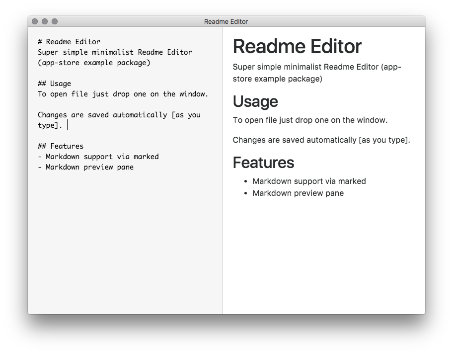

# Readme Editor
Super simple minimalist Readme Editor (app-store example package)

## Usage
To open file just drop one on the window.

Changes are saved automatically [as you type]. 

## Features
- Markdown support via marked
- Markdown preview pane
